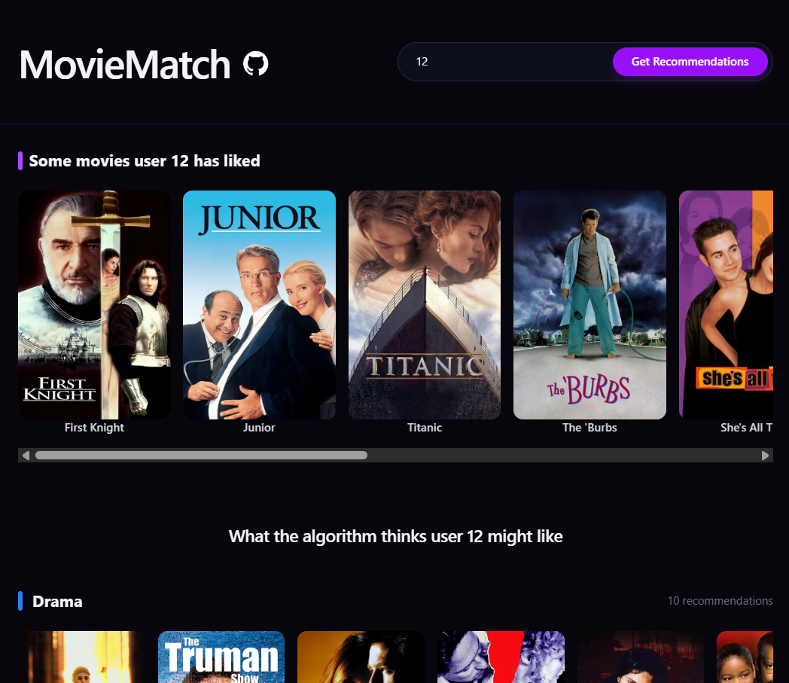
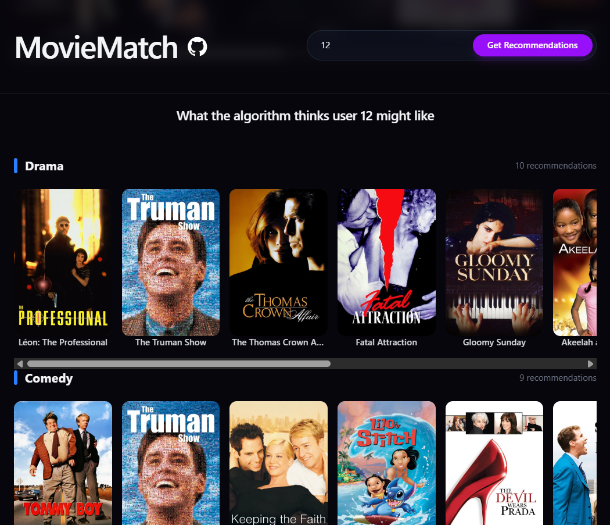

# MovieMatch

MovieMatch is a full-stack movie recommendation web application built to explore and understand how modern recommendation systems are designed and optimized.

> **Project Scope Disclaimer**: The algorithmic backend, data parsing pipeline, API orchestration, and Docker configurations were custom-coded entirely by me from scratch. The React frontend was integrated from an existing template/boilerplate to serve purely as a visual dashboard for displaying the computed recommendations.


## System Architecture

The application is split into two layers:

1. **Backend & Recommendation Engine (Custom-Coded)**: A high-performance, asynchronous FastAPI system running on Python. It handles mathematical computations via `pandas` and `numpy`, data modeling, and asynchronous external network calls.
2. **Frontend UI (Integrated Template)**: A single-page dashboard built with React, Vite, TypeScript, and Tailwind CSS to group recommendations dynamically by genre.


## How the Recommendation Algorithm Works

The core of my backend work relies on an item-rating **Collaborative Filtering** system utilizing **Cosine Similarity** to match tastes between peer user matrices.

### Step 1: Pivoting and Vector Alignment

The backend loads raw data from MovieLens-style structures (`ratings.csv`, `movies.csv`, `links.csv`) and shapes them into a User-Item pivot matrix, where row indexes represent unique `userId`s, columns track `movieId`s, and coordinates reflect individual rating integers.

### Step 2: Mean-Centering (Normalizing Preference Scaling)

To eliminate individual user biases (e.g., compensating for users who naturally rate movies highly versus critical users who rarely score above 3 stars), the script calculates the target user's mean rating ($\mu_u$) and subtracts it from all their entries:


$$\text{Normalized Rating}_{u, m} = \text{Rating}_{u, m} - \mu_u$$

### Step 3: Intersection Filtering

When evaluating a profile pair, the algorithm avoids noise by verifying that both users share a intersection threshold of **at least 15 movies in common**. If met, the dimensions are sub-sliced to represent only those mutual films before calculating angles.

### Step 4: Cosine Similarity Computation

The backend quantifies the preference proximity between the target user and neighbor vectors via the dot product divided by the product of their Euclidean lengths:


$$\text{Similarity}(A, B) = \frac{A \cdot B}{\|A\| \|B\|}$$

### Step 5: Candidate Selection Pipeline

1. The mathematical engine ranks similarities in descending order.
2. It loops over top-tier matching neighbors to grab movies they marked highly ($\ge 4$ stars) which the active target user **has not yet logged**.
3. Up to 25 unique indices are mapped across the dataset indices via `links.csv` to extract standard global IDs.


## Parallel Metadata Fetching

To maximize backend efficiency, I built an asynchronous orchestration layer using `httpx` and `asyncio.gather` inside FastAPI:

* Once the similarity engine resolves the 25 recommended dataset IDs, the backend maps them to TMDB-compliant parameters.
* Instead of sequentially querying metadata, it spins up parallel async threads to fetch production text, poster paths, and movie genre data from TMDB endpoints.
* The organized dataset payload is then consolidated and pushed downstream to the UI.


## Getting Started

### Prerequisites

* Docker and Docker Compose.
* A TMDB v4 Read Access Token (API bearer key).

### Environment Configuration

Create a `.env` file in the root directory:

```env
# TMDB Authentication
TMDB_API_KEY=your_tmdb_bearer_token_here

# Network Mappings
FRONT_URL=http://localhost:8200
VITE_BACK_URL=http://127.0.0.1:8000
```

### Deployment

I configured Docker structures to spin up the independent components concurrently:

```bash
docker compose up --build -d
```

* **FastAPI Backend Service**: Interoperable at [http://localhost:8000](http://localhost:8000)
* **Web UI Viewport Template**: Displaying metrics at [http://localhost:8200](http://localhost:8200)

### Isolated Algorithm Execution

To run and debug my backend logic directly via terminal streams without launching the web server:

```bash
cd server
pip install -r ../requirements.txt
python algorithm.py [USER_ID]
```

*(Example: `python algorithm.py 5` generates standard raw stdout recommendation dictionaries for user ID 5)*

## Screenshots

### Web Dashboard (Frontend Template)


